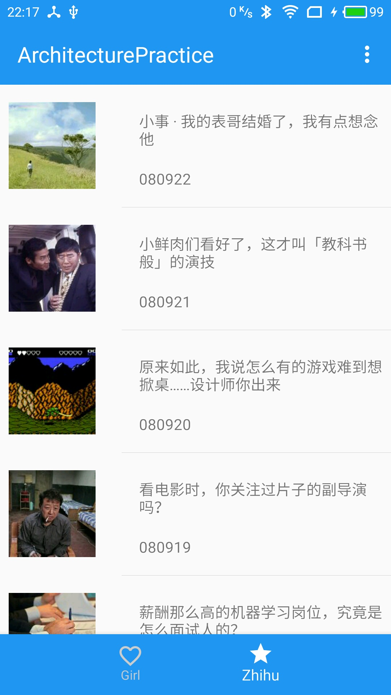

## ArchitecturePractice

I wrote an article to introduce this project named of ArchitecturePractice.

* [Android 应用架构组件（Architecture Components）实践](http://lijiankun24.com/Android-应用架构组件（Architecture-Components）实践/)

Scan below QR code to download the apk.
<div align=center>
    
</div>

I would introduce the structure of ArchitecturePractice by way of the Zhihu portion.
### ZhihuList
You should to complete the view below and you have two apis to access Zhihu List.
<div align=center>
    
</div>

```
  // 请求最新的知乎列表（下拉刷新）
  https://news-at.zhihu.com/api/4/news/latest

  // 上拉加载历史列表（上拉加载更多）
  https://news-at.zhihu.com/api/4/news/before/{date}
```

### View layer
The source code of ZhihuListFragment(leave some unimportant code out):
``` Java
/**
 * ZhihuListFragment.java
 * <p>
 * Created by lijiankun on 17/7/30.
 */

public class ZhihuListFragment extends LifecycleFragment {

    // ZhihuListFragment 所对应的 ViewModel 类的对象
    private ZhihuListViewModel mListViewModel = null;

    ......

    @Override
    public View onCreateView(LayoutInflater inflater, ViewGroup container,
                             Bundle savedInstanceState) {
        View view = inflater.inflate(R.layout.fragment_zhihu_list, container, false);
        initView(view);
        return view;
    }

    @Override
    public void onActivityCreated(@Nullable Bundle savedInstanceState) {
        super.onActivityCreated(savedInstanceState);
        subscribeUI();
    }

    /**
     * 将 ZhihuListFragment 对应的 ZhihuListViewModel 类中的 LiveData 添加注册监听到
     * 此 ZhihuListFragment
     */
    private void subscribeUI() {
        // 通过 ViewModelProviders 创建对应的 ZhihuListViewModel 对象
        ZhihuListViewModel.Factory factory = new ZhihuListViewModel
                .Factory(MyApplication.getInstance()
                , Injection.getDataRepository(MyApplication.getInstance()));
        mListViewModel = ViewModelProviders.of(this, factory).get(ZhihuListViewModel.class);
        mListViewModel.getZhihuList().observe(this, new Observer<List<ZhihuStory>>() {
            @Override
            public void onChanged(@Nullable List<ZhihuStory> stories) {
                if (stories == null || stories.size() <= 0) {
                    return;
                }
                mAdapter.setStoryList(stories);
            }
        });
        mListViewModel.isLoadingZhihuList().observe(this, new Observer<Boolean>() {
            @Override
            public void onChanged(@Nullable Boolean aBoolean) {
                if (aBoolean == null) {
                    return;
                }
                mRefreshLayout.setRefreshing(false);
                mLoadMorebar.setVisibility(aBoolean ? View.VISIBLE : View.INVISIBLE);
            }
        });
        mListViewModel.refreshZhihusData();
    }

    ......
}
```

### ViewModel layer
`ZhihuListViewModel` is responsible to connect the `ZhihuLiveFragment`(View layer) and 'DataRepository'(Model layer), `ZhihuLiveViewModel` hold LiveData and DataRepository, the LiveData works like RxJava's Observables, they will notify the observer(ZhihuLiseFragment) when the data is Available, and the DataRepository is datasource. TheThe source code of `ZhihuListViewModel` is:
``` Java
/**
 * ZhihuListViewModel.java
 * <p>
 * Created by lijiankun on 17/7/30.
 */

public class ZhihuListViewModel extends AndroidViewModel {

    // 请求接口中查询的日期参数
    private MutableLiveData<String> mZhihuPageDate = new MutableLiveData<>();

    // Zhihu 列表的数据
    private final LiveData<List<ZhihuStory>> mZhihuList;

    // 数据源
    private DataRepository mDataRepository = null;

    private ZhihuListViewModel(Application application, DataRepository dataRepository) {
        super(application);
        mDataRepository = dataRepository;
        // 使用 Transformations.switchMap() 方法，当 View 改变 mZhihuPageDate 参数的值时，则进行 zhihu 列表数据的请求
        mZhihuList = Transformations.switchMap(mZhihuPageDate, new Function<String, LiveData<List<ZhihuStory>>>() {
            @Override
            public LiveData<List<ZhihuStory>> apply(String input) {
                return mDataRepository.getZhihuList(input);
            }
        });
    }

    /**
     * 获取 Zhihu 列表数据
     *
     * @return Zhihu 列表数据
     */
    public LiveData<List<ZhihuStory>> getZhihuList() {
        return mZhihuList;
    }

    /**
     * 数据请求状态由 DataRepository 控制，包括下拉刷新和上拉加载更多
     *
     * @return 是否在进行数据请求
     */
    public LiveData<Boolean> isLoadingZhihuList() {
        return mDataRepository.isLoadingZhihuList();
    }

    /**
     * 下拉刷新，获取最新的 Zhihu 列表数据
     */
    public void refreshZhihusData() {
        mZhihuPageDate.setValue("today");
    }

    /**
     * 上拉加载更多时，获取 Zhihu 历史列表数据
     *
     * @param positon 表示列表滑动到最后一项
     */
    public void loadNextPageZhihu(int positon) {
        if (!Util.isNetworkConnected(MyApplication.getInstance())) {
            return;
        }
        mZhihuPageDate.setValue(String.valueOf(positon));
    }

    public static class Factory extends ViewModelProvider.NewInstanceFactory {

        @NonNull
        private final Application mApplication;

        private final DataRepository mGirlsDataRepository;

        public Factory(@NonNull Application application, DataRepository girlsDataRepository) {
            mApplication = application;
            mGirlsDataRepository = girlsDataRepository;
        }

        @Override
        public <T extends ViewModel> T create(Class<T> modelClass) {
            return (T) new ZhihuListViewModel(mApplication, mGirlsDataRepository);
        }
    }
}
```

### Model layer
The DataRepository represents the Model layer to work with ZhihuListViewModel(ViewModel layer), and the DataRepository contains two DataSources(from remote and from local). The DataSource is an interface to provide api to access data and the source code is(leave some irrelevant code out):
``` Java
/**
 * DataSource.java
 * <p>
 * Created by lijiankun on 17/7/7.
 */

public interface DataSource {

    ......

    /**
     * Zhihu 相关方法
     */
    LiveData<List<ZhihuStory>> getLastZhihuList();

    LiveData<List<ZhihuStory>> getMoreZhihuList(String date);

    ......

    LiveData<Boolean> isLoadingZhihuList();
}
```

The DataRepository provides pure API for ViewModel layer to access data and the source code of DataRepository(leave some irrelevant code out):
``` Java
/**
 * DataRepository.java
 * <p>
 * Created by lijiankun on 17/7/7.
 */

public class DataRepository {

    private static DataRepository INSTANCE = null;

    private final DataSource mRemoteDataSource;

    private final DataSource mLocalDataSource;

    private static Application sApplication = null;

    private DataRepository(@NonNull DataSource remoteDataSource,
                           @NonNull DataSource localDataSource) {
        mRemoteDataSource = remoteDataSource;
        mLocalDataSource = localDataSource;
    }

    static DataRepository getInstance(@NonNull DataSource remoteDataSource,
                                      @NonNull DataSource localDataSource,
                                      Application application) {
        if (INSTANCE == null) {
            synchronized (DataRepository.class) {
                if (INSTANCE == null) {
                    INSTANCE = new DataRepository(remoteDataSource, localDataSource);
                    sApplication = application;
                }
            }
        }
        return INSTANCE;
    }

    ......

    public LiveData<List<ZhihuStory>> getZhihuList(@NonNull String date) {
        if (Util.isNetworkConnected(sApplication.getApplicationContext())) {
            if (date.equals("today")) {
                return mRemoteDataSource.getLastZhihuList();
            } else {
                return mRemoteDataSource.getMoreZhihuList(date);
            }
        } else {
            if (date.equals("today")) {
                return mLocalDataSource.getLastZhihuList();
            } else {
                return mLocalDataSource.getMoreZhihuList(date);
            }
        }
    }

    ......

    public LiveData<Boolean> isLoadingZhihuList() {
        if (Util.isNetworkConnected(sApplication.getApplicationContext())) {
            return mRemoteDataSource.isLoadingZhihuList();
        } else {
            return mLocalDataSource.isLoadingZhihuList();
        }
    }
}
```

The RemoteDataSource implemeting the interface of DataSource requests data from remote and in [ArchitecturePractice](https://github.com/lijiankun24/ArchitecturePractice) project uses Retrofit to request data from network, the ApiManager is an class to manager retrofit interface.
``` Java
/**
 * RemoteDataSource.java
 * <p>
 * Created by lijiankun on 17/7/7.
 */

public class RemoteDataSource implements DataSource {

    private static RemoteDataSource INSTANCE = null;

    private final MutableLiveData<Boolean> mIsLoadingZhihuList;

    private final MutableLiveData<List<ZhihuStory>> mZhihuList;

    private final ApiZhihu mApiZhihu;

    private String mZhihuPageDate;

    {
        mIsLoadingZhihuList = new MutableLiveData<>();
        mZhihuList = new MutableLiveData<>();
    }

    ......

    private RemoteDataSource() {
        mApiZhihu = ApiManager.getInstance().getApiZhihu();
    }

    public static RemoteDataSource getInstance() {
        if (INSTANCE == null) {
            synchronized (RemoteDataSource.class) {
                if (INSTANCE == null) {
                    INSTANCE = new RemoteDataSource();
                }
            }
        }
        return INSTANCE;
    }

    ......

    @Override
    public LiveData<List<ZhihuStory>> getLastZhihuList() {
        mIsLoadingZhihuList.setValue(true);
        mApiZhihu.getLatestNews()
                .enqueue(new Callback<ZhihuData>() {
                    @Override
                    public void onResponse(Call<ZhihuData> call, Response<ZhihuData> response) {
                        if (response.isSuccessful()) {
                            mZhihuList.setValue(response.body().getStories());
                            refreshLocalZhihuList(response.body().getStories());
                            mZhihuPageDate = response.body().getDate();
                        }
                        mIsLoadingZhihuList.setValue(false);
                    }

                    @Override
                    public void onFailure(Call<ZhihuData> call, Throwable t) {
                        mIsLoadingZhihuList.setValue(false);
                    }
                });
        return mZhihuList;
    }

    @Override
    public LiveData<List<ZhihuStory>> getMoreZhihuList(String date) {
        mIsLoadingZhihuList.setValue(true);
        mApiZhihu.getTheDaily(mZhihuPageDate)
                .enqueue(new Callback<ZhihuData>() {
                    @Override
                    public void onResponse(Call<ZhihuData> call, Response<ZhihuData> response) {
                        if (response.isSuccessful()) {
                            mZhihuList.setValue(response.body().getStories());
                            refreshLocalZhihuList(response.body().getStories());
                            mZhihuPageDate = response.body().getDate();
                        }
                        mIsLoadingZhihuList.setValue(false);
                    }

                    @Override
                    public void onFailure(Call<ZhihuData> call, Throwable t) {
                        mIsLoadingZhihuList.setValue(false);
                    }
                });
        return mZhihuList;
    }

    ......

    @Override
    public MutableLiveData<Boolean> isLoadingZhihuList() {
        return mIsLoadingZhihuList;
    }

    ......

    private void refreshLocalZhihuList(List<ZhihuStory> zhihuStoryList) {
        if (zhihuStoryList == null || zhihuStoryList.isEmpty()) {
            return;
        }
        AppDatabaseManager.getInstance().insertZhihuList(zhihuStoryList);
    }
}
```

The LocalDataSource implemeting the interface of DataSource load data from local database and in [ArchitecturePractice](https://github.com/lijiankun24/ArchitecturePractice) project uses Room to store data, the AppDatabaseManager is an class to manager local database.
``` Java
/**
 * LocalDataSource.java
 * <p>
 * Created by lijiankun on 17/7/7.
 */

public class LocalDataSource implements DataSource {

    private static LocalDataSource INSTANCE = null;

    private LocalDataSource() {
    }

    public static LocalDataSource getInstance() {
        if (INSTANCE == null) {
            synchronized (LocalDataSource.class) {
                if (INSTANCE == null) {
                    INSTANCE = new LocalDataSource();
                }
            }
        }
        return INSTANCE;
    }

    ......

    @Override
    public LiveData<List<ZhihuStory>> getLastZhihuList() {
        return AppDatabaseManager.getInstance().loadZhihuList();
    }

    @Override
    public LiveData<List<ZhihuStory>> getMoreZhihuList(String date) {
        return null;
    }

    @Override
    public LiveData<Boolean> isLoadingZhihuList() {
        return AppDatabaseManager.getInstance().isLoadingZhihuList();
    }
}

```
